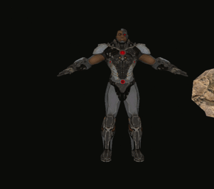
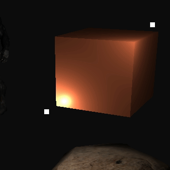

# OpenGL Projects

## Description
Here are four projects that we made during the Computer Graphics course in the university. All the geometric calculations (including rotations, projection, shading techniques, camera movement) were implemented from scratch using analytic geometry and linear algebra. We didn't use frameworks, that was made with "vanilla" OpenGL and a few libraries.

The projects are:
* Work 1: basic wind mill with colors and 2D rotation.


* Work 2: loading 3D objects and applying rotations to it.


* Work 3: orthographic and perspective projection.



* Work 4: apply lighting using Gouraud and Phong shading techniques.



You can download the versions in the Releases tab.

## Tech stack
* CMake
* C++
* OpenGL

## Prerequisites
* cmake
* make
* g++
* assimp (for loading 3D object file)

### Installing Assimp

For installing Assimp on Ubuntu 18.04 execute:
```
	sudo apt-get install libassimp4 assimp-utils
```

For another distributions, you can install from your repositories, or from the source code like this:
```
	git clone https://github.com/assimp/assimp.git
	cd assimp
	mkdir build
	cd build
	cmake ..
	sudo make install
```

## Usage
Download the repository. In the root directory execute:
```
    mkdir build && cd build
    cmake ..
```

Compile and execute:
```
    make run
```
